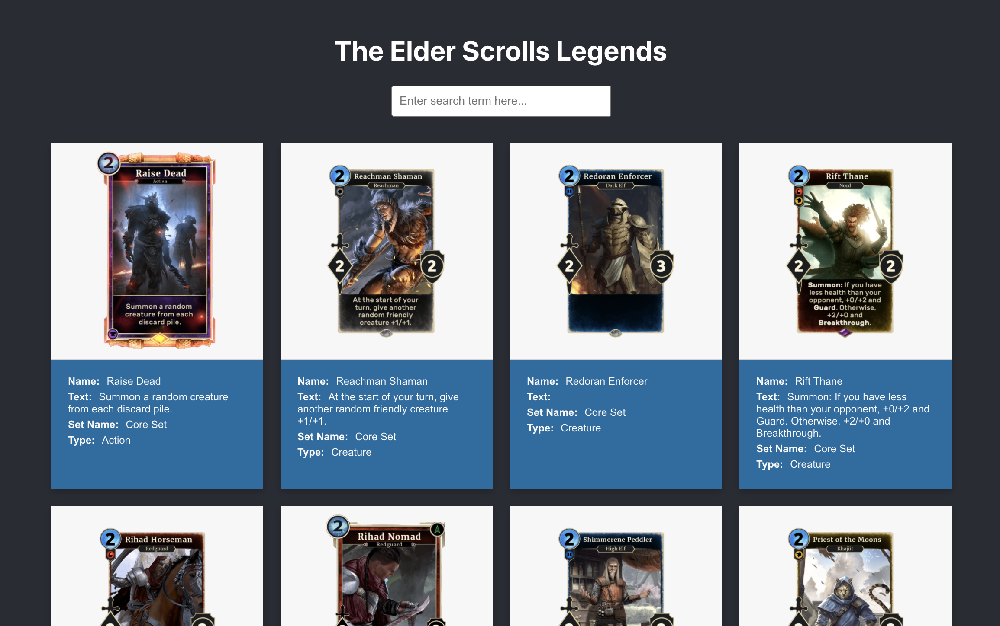
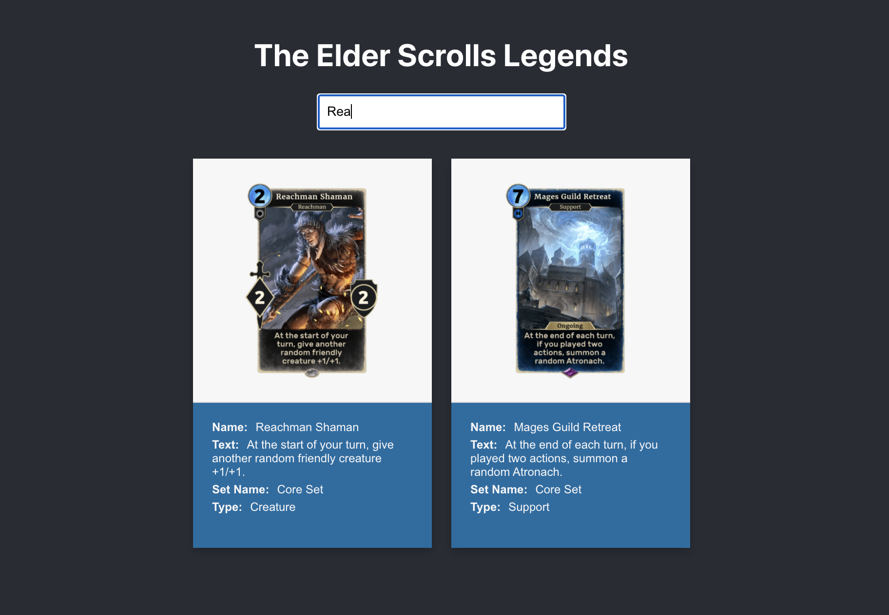
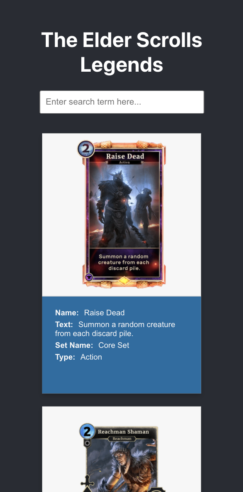

# Elder Scrolls App

This project was bootstrapped with [Create React App](https://github.com/facebook/create-react-app).

### `Prerequisites`
* Installation requires `git` to be set up on the desired device 

### `Getting Started`

* Clone `git@github.com:tenshiemi/elder-scrolls-project.git` to your local machine
* Navigate to the `elder-scrolls-project` folder
* Run the command `yarn install`
* After that finishes, run the command `yarn start`
* Open [http://localhost:3000](http://localhost:3000) to view it in the browser.

### Notes

* Mobile view was tested using the Chrome Devtools rather than on an actual device.
* Tested in Chrome and Firefox

### Dependencies

* [Create React App](https://github.com/facebook/create-react-app)
* [Styled Components](https://github.com/styled-components/styled-components)
* [Axios](https://github.com/axios/axios)
* [Typescript](https://www.typescriptlang.org/)

### Screenshots

<h4>Loading Spinner</h4>

<h4>Default View</h4>

<h4>Search View</h4>

<h4>Mobile View (iPhone 12 simulator)</h4>

